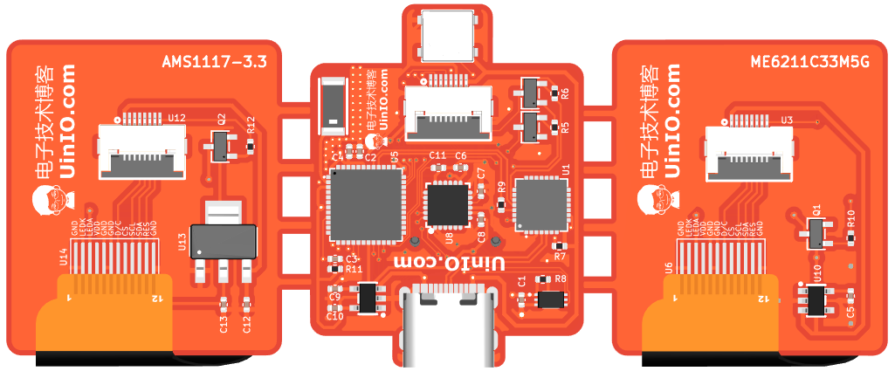
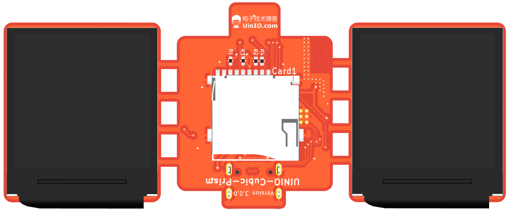

# UINIO-Cubic-Prism 分光棱镜展示器

一款基于 [**上海乐鑫科技 ESP32-PICO-D4**](https://products.espressif.com/) 微控制器的分光棱镜展示器。

## 工程目录说明

```
├─BOM                     电路原理图以及动态 BOM 文件
├─CAD                     3D 打印模型文件
│  ├─GCode                Cura 切片文件，仅适用于型号为 Vyper 的 3D 打印机
│  └─STL                  模型 STL 文件
├─Firmware                开源固件
├─Gerbers                 用于加工 PCB 电路板的光绘文件
├─Images                  README 图片素材
├─Libraries               KiCAD 原理图库、封装库、3D 模型库
│  ├─Uinika.3D
│  └─Uinio.Footprint
└─Tools                   固件烧写工具、屏幕共享工具、图片格式转换工具
```

## PCB 硬件电路





- 完全兼容 **Github** 上的 [HoloCubic_AIO](https://github.com/ClimbSnail/HoloCubic_AIO) 固件及其相关工具；
- 电路原理图进行了重绘，同时 PCB 也重新进行了手动布线，尽可能多的进行大面积铺铜；
- 天线屏蔽使用 2 排接地过孔（省略了阻抗匹配电路）；
- 同时提供 `AMS1117-3.3` 以及 `ME6211C33M5G` 两款线性稳压器芯片的屏幕显示模组方案，便于进行拼板打样；
- 更换了 TF 卡座为更加便宜并且比较容易购买的 封装形式；
- 屏幕扩展板和主板使用的稳压器芯片的 `3.3V` 完全隔离，多个稳压器并不能像其它开源的原理图当中那样，被简单的并联起来使用；
- 工程当中的 `Tools` 包含了常用的固件烧写、屏幕分享、图片转换工具；
- 主板与屏幕扩展板采用 `10cm` 长度的 `8Pin` 同向 FPC 软排线进行连接；

## CAD 外壳模型

项目当中的 `CAD` 目录，是为 **UINIO-CUBIC** 重新设计的外壳模型，以适配本项目的 PCB 尺寸；分光棱镜分别采用左右两个延伸柱进行固定，免去使用胶水粘结到屏幕上的麻烦。


CAD 模型分为上下两个部分（分别对应 FreeCAD 工程里的 `Base` 和 `Cover` 两个零件），分别用于安装**主板**与**屏幕扩展板**。


本 CAD 外壳模型分光棱镜的倾斜角度提升至 30 度，从而提升放置在桌面时的可视角度。并且将底部进行了掏空处理，提升主板的散热能力，同时也便于插拔 TF 卡。


RGB 发光二极管对应的外壳位置，专门进行了掏空处理，便于启动时观察其工作状态。左右两侧预留有 `2mm` 直径的沉头螺丝开孔以及相应的装饰盖（使用胶水粘接），可以根据 3D 打印出来的模型契合度按需进行使用。

## 固件与工具

|           名称           | 下载地址                                            | 描述                                |
| :----------------------: | :-------------------------------------------------- | :---------------------------------- |
|    **HoloCubic AIO**     | https://github.com/ClimbSnail/HoloCubic_AIO         | 兼容 UINIO-Cubic-Prism 的开源固件。 |
|  **HoloCubic AIO Tool**  | https://github.com/ClimbSnail/HoloCubic_AIO_Tool    | 固件烧录工具、图片与视频转换工具。  |
| **LVGL Image Converter** | https://github.com/W-Mai/lvgl_image_converter       | 基于 LVGL 的图片转换工具。          |
|    **ESP32 投屏工具**    | https://gitee.com/superddg123/esp32-TFT/tree/master | 运行在电脑上的 ESP32 投屏上位机。   |
|     **天气时钟 API**     | https://www.tianqiapi.com/                          | 内置的天气时钟 API 服务申请地址。   |
